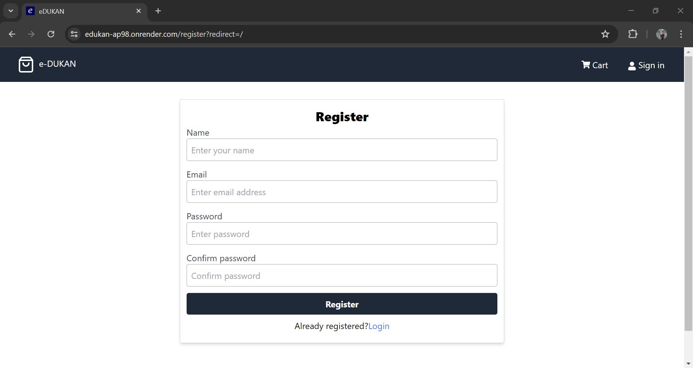

# eDUKAN

This is an e-commerce web application built using the MERN stack (MongoDB, Express.js, React.js, Node.js) and styled with Tailwind CSS.

## Features

- **Admin Panel**: Allows administrators to perform CRUD operations on products and users.
- **User Accounts**: Users can register, log in, and perform actions such as purchasing products, rating, and reviewing.

## Admin Credentials

- email: admin@email.com
- Password: 123456

## User Credentials

- email: userone@email.com
- Password: 123456

## Technologies Used

- MongoDB
- Express.js
- React.js
- Node.js
- Tailwind CSS

## Deployment

The project is deployed and accessible at [https://edukan-ap98.onrender.com/](https://edukan-ap98.onrender.com/).

Note: Intial load time may take long due use of free plan at render. Further load time will be faster.

## Usage

### Admin Panel

- Access the admin panel by logging in with the above given credentials 
- Click on 'Admin' dropdown in the top left.
- From the admin panel, you can:
  - Create, read, update, and delete products.
  - Manage orders and user accounts.

### User Account

- Users can register for an account or log in using the user credentials provided above.
- Once logged in, users can:
  - Browse products.
  - Add products to the cart.
  - Purchase products.
  - Rate and review products.

## Snapshots
#### Sign up page

## Disclaimer

Products in this projects belongs to Amazon, Flipkart and Google. This webapp is built for educational purposes only and reselling of any kind is not intended.
